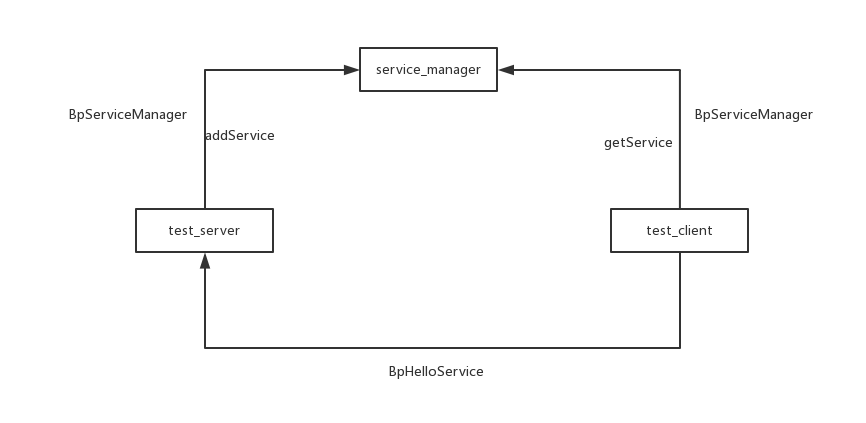

# 代理类BpXXX分析



* test_server通过BpServiceManager与service_manager通信，使用addService，此时test_server充当client角色，service_manager则是充当server角色
* test_client也是通过BpServiceManager与service_manager通信，使用getService，此时test_client充当client角色，service_manager则是充当server角色
* test_client与test_server之间则是通过BpHelloService通讯
*******
* BpServiceManager：handle = 0
* BpHelloService：handle = ？==>BpServiceManager->getService("Hello"),结果应该是1
1. handle不同
2. 构造的数据不同
*****


## 获得BpServiceManager对象的过程：
_defaultServiceManager_ 构造了一个 _BpServiceManager_ 对象，其中它的mRemote = new BpBinder(0);//mRemote->mHandle=0;

* defaultServiceManager //IServiceManager.cpp
```
sp<IServiceManager> defaultServiceManager()
{
    if (gDefaultServiceManager != NULL) return gDefaultServiceManager;
    
    {
        AutoMutex _l(gDefaultServiceManagerLock);
        while (gDefaultServiceManager == NULL) {
//把BpBinder对象(mHandle = 0)转换为IServiceManager接口(BpServiceManager)
            gDefaultServiceManager = interface_cast<IServiceManager>(
                ProcessState::self()->getContextObject(NULL));
            if (gDefaultServiceManager == NULL)
                sleep(1);
        }
    }
    
    return gDefaultServiceManager;
}

```
* 分析：
1. 把*BpBinder*对象(mHandle = 0)转换为 _IServiceManager_ 接口(BpServiceManager)
gDefaultServiceManager = interface_cast<IServiceManager>(ProcessState::self()->getContextObject(NULL));

2. ProcessState::self()->getContextObject(NULL)
```
sp<IBinder> ProcessState::getContextObject(const sp<IBinder>& /*caller*/)
{
    return getStrongProxyForHandle(0);
}
sp<IBinder> ProcessState::getStrongProxyForHandle(int32_t handle)
{
...
	b = new BpBinder(handle); //传入的handle为0，mHandle=handle=0
...
}

BpBinder::BpBinder(int32_t handle)
    : mHandle(handle)//传入的handle为0，mHandle=handle=0
    , mAlive(1)
    , mObitsSent(0)
    , mObituaries(NULL)
{
    ALOGV("Creating BpBinder %p handle %d\n", this, mHandle);

    extendObjectLifetime(OBJECT_LIFETIME_WEAK);
    IPCThreadState::self()->incWeakHandle(handle);
}
```
* 转换过程：以上流程结束后，得到一个BpBinder对象
interface_cast<IServiceManager>(new BpBinder(0)) //IInterface.h
IServiceManager::asInterface(obj);
核心：
	intr = new BpServiceManager(obj); //mRemote obj = new BpBinder(0);
  	return intr; 
```
   const android::String16 IServiceManager::descriptor(NAME);             \
    const android::String16&                                            \
            IServiceManager::getInterfaceDescriptor() const {              \
        return IServiceManager::descriptor;                                \
    }                                                                   \
    android::sp<IServiceManager> IServiceManager::asInterface(                \
            const android::sp<android::IBinder>& obj)                   \
    {                                                                   \
        android::sp<IServiceManager> intr;                                 \
        if (obj != NULL) {                                              \
            intr = static_cast<IServiceManager*>(                          \
                obj->queryLocalInterface(                               \
                        IServiceManager::descriptor).get());               \
            if (intr == NULL) {                                         \
                intr = new BpServiceManager(obj);                          \
            }                                                           \
        }                                                               \
        return intr;                                                    \
    }                                                                   \
    IServiceManager::IServiceManager() { }                                    \
    IServiceManager::~IServiceManager() { }                                   \
```

## 获得BpHelloService对象的过程：
调用 _BpServiceManager_ 的 _getService_ 函数，获得一个 _flat_binder_object_ ，从中取出handle，创建一个 _BpBinder_ (handle),然后使用 _interface_cast_ 使用这个BpBinder创建一个 _BpHelloService_ 对象

//binder是BpBinder对象，里面含有HelloService的handle
sp<IBinder> binder = sm->getService(String16("hello"));//IServiceManager.cpp
* 构造数据：数据中肯定含有“hello”
* 发送数据：给handle 0，即svc_mgr进程
* 从收到的回复中取出HelloService的handle
```
return reply.readStrongBinder();
-->  unflatten_binder(ProcessState::self(), *this, &val);
	-->	*out = proc->getStrongProxyForHandle(flat->handle);
   		--> new BpBinder(handle);
```
//把binder转换为IHelloService接口(BpHelloService对象)
//binder是BpBinder对象，里面含有HelloService的handle
sp<IHelloService> service = interface_cast<IHelloService>(binder);

# 获得BpServiceManager、BpHelloService的过程
## 重点
### handle：
* 对于BpServiceManager，handle=0；对于BpHelloService，handle来自getService
1. BpServiceManager派生自BpRefBase，含有IBinder *mRemote
2. BpHelloService派生自BpRefBase，含有IBinder *mRemote指向BpBinder对象，它含有mHandle

#### 获得BpServiceManager：
interface_cast<IServiceManager>(new BpBinder(0))
#### 获得BpHelloService：
binder = sm->getService("hello") ,最终调用 new BpBinder(handle),handle来自svc_mgr进程回复的数据
interface_cast<IHelloService>(binder)


## 代理类如何发送数据
驱动程序中通过ioctl，数据里含有handle，含有其他构造的参数
****
Cpp 则是构造好数据之后调用remote()->transact(...)
```
status_t BpBinder::transact(uint32_t code, const Parcel& data, Parcel* reply, uint32_t flags)
{
....
	status_t status = IPCThreadState::self()->transact(mHandle, code, data, reply, flags);
....
}
```


