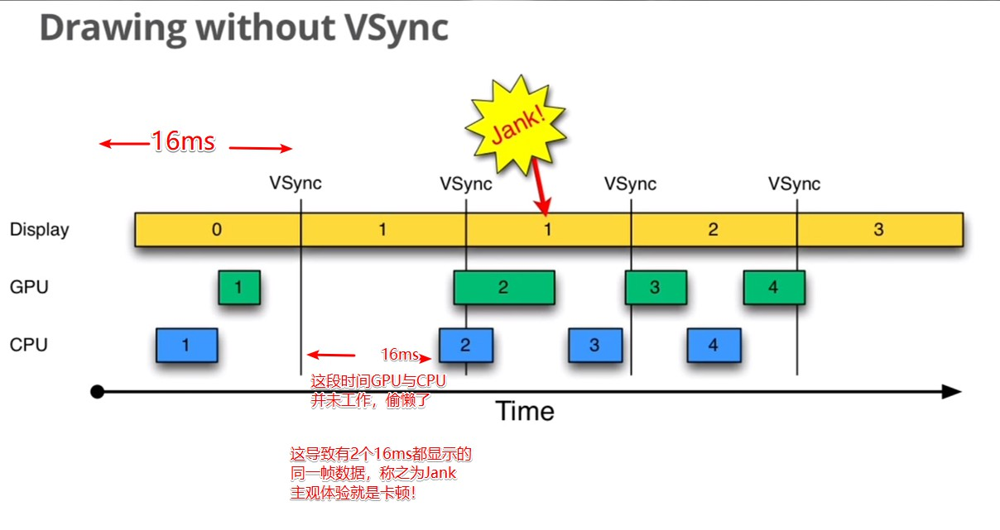
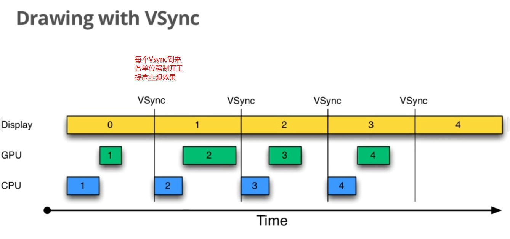

# 001_黄油计划_三个方法改进显示系统

标签（空格分隔）： Vsync

---

# 黄油计划
## Vsync
要想使得用户有较好的视觉体验，达到60FPS是必不可少的条件，相当于每16ms就要刷一幅图。

### 没有Vsync机制时

### 优化一：Vsync时强制开工

### 优化二：triple buffer
* 如果数据量太大，可能导致GPU未能在规定时间内完成，那么可能会导致后续所有的buffer都混乱掉

* 增加一个buffer，在Jank期间CPU在C Buffer中构造数据，当GPU构造完B Buffer后，GPU就可以继续构造C Buffer的数据，此时显示GPU刚刚构造完的B Buffer...

### 优化三：Vsync虚拟化
* app->SF->Display，app生成新画面后，在下一个Vsync到来时，SF才能合并新画面；SF合并完新画面后，在下一个Vsync到来时才能送给Display。这一次操作就花了32ms，导致画面十分卡顿 
* 根源：所有单位在Vsync到来时才开始工作
* 解决方法：让SF在APP就绪后，及时开工，这就使得最多有16ms的延迟
#### Vsync - App
#### Vsync - SF(SurfaceFlinger)

