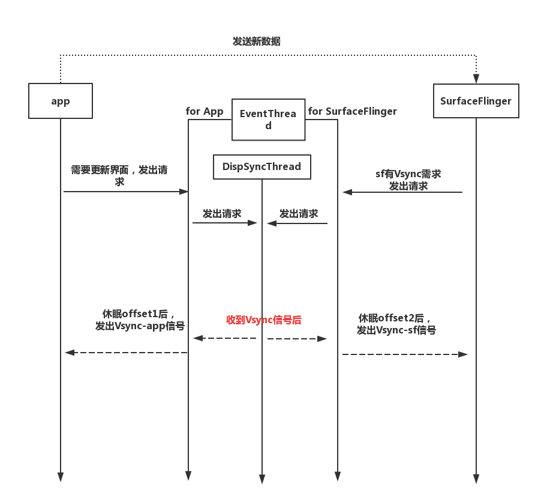

# 002_Vsnyc框架

标签（空格分隔）： Display Vsync

---


## 几个要点
 - 谁产生Vsync:H/W,S/W(`VsyncThread`)
 - 谁处理Vsync：某个线程——`DispSyncThread`
 - Vsync：app&SF——谁将Vsync虚拟化？——`DispSyncThread`
 - Vsync-app&SF怎么起作用？按需产生

 ```seq
 App->EventThread(app):请求Vsync
 EventThread(app)->App:唤醒,app开始产生新界面
 ```
 ```seq
 SF->EventThread(sf):请求Vsync
 EventThread(sf)->SF:唤醒,sf开始合成界面
 ```


# 框架
## 谁产生Vsync？
- 硬件Vsync 或 软件Vsync
软件Vsync其实是一个线程`VsyncThread`，每次休眠16ms，发出信号唤醒线程

## 谁处理Vsync？
- `DispSyncThread`线程接收Vsync信号
休眠`offset1`，唤醒等待`Vsync-app`的线程——`EventThread for app`
休眠`offset2`，唤醒等待`Vsync-sf`的线程—`EventThread for sf`

对于`EventThread for app`，会有多个线程`connection`到它上面，如app1,app2...`EventThread`大多数时刻处于休眠状态，当收到信号后才会唤醒需要更新界面的app——这就需要app需要更新界面时，向`EventThread`提出请求->设置`connection.count >= 0`
对于`EventThread for sf`，只有一个线程`connection`到它上，即`surfaceflinger` ;而sf也会与多个app通过`queueBuffer`建立联系，但有需要时，sf也会通过设置`connection.count >= 0`向`EventThread`发出请求



#### app与`Vsync-app`
 1.  App 有更新界面的需要时，它需要得到`Vsync-app`
 2. 于是向`EventThread for app`提出请求
 3. `EventThread for app`再向`DispSyncThread`提出请求
 4. `DispSyncThread`收到`Vsync`后，休眠`offset1`后再发出`Vsync-app`信号

#### app与`Vsync-sf`
 1. app把新数据发给sf
 2. sf有`Vsync`需求，向`EventThread for sf`发出请求
 3. `EventThread for sf`再向`DispSyncThread`发出请求
 4. `DispSyncThread`收到`Vsync`信号，休眠`offset2`后发出`Vsync-sf`信号，然后`EventThread for sf`就被唤醒...依次反馈
