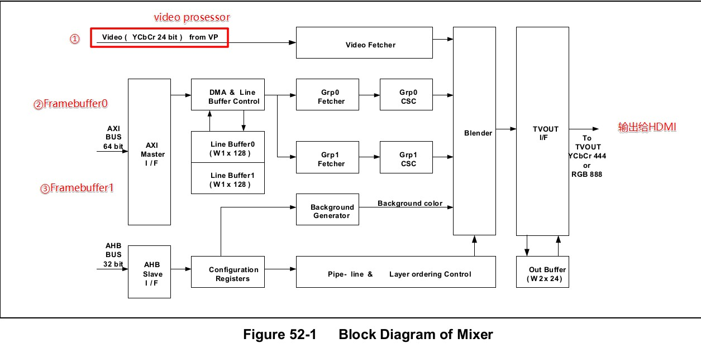

# 001_HDMI硬件介绍

标签（空格分隔）： Display HDMI

---

## 显示原理（对于`TFT`接口）
"电子枪"从左往右、从上往下移动，打出每个像素的颜色
### 怎么控制电子枪移动？
#### 谁来控制它右移一个像素
`VCLK`像素时钟
#### 谁控制它从最右边移动到最左边
`HSync`行同步信号
#### 谁控制它从最下面跳到最上面
`VSync`列同步信号
### 颜色来源
每个像素的颜色可以分为R、G、B三原色，怎么传输？
RGB通过DATA线传输，电子枪在每个`VCLK`时钟读DATA线
### 数据线上的数据来源
主控的LCD控制器会发出各时钟信号、数据
主控外的memory会划分出一块Framebuffer，告诉LCD控制器
> LCD控制器读取Framebuffer

## TFT接口的缺点
* 线太多，至少27线
* 抗干扰能力差
* 不能传输高速率的数据，不能传输高清视频，不能长距离传输

## HDMI
主控输出的HDMI数据信号里应该包括：
* HSYNC、VSYNC
* DATA：RGB
* 音频信号

* 差分信号可以提高抗干扰能力

4412的HDMI：

比一般的TFT LCD多了：
* 多个显示源：Framebuffer数量变多、videoProsessor、背景
* 混合器Blender：Mixer
* 音频
* i2c：可以接有一些ROM（EDID ROM,存有分辨率、厂家信息等)、版权保护的模块（HDCP）
* CEC（遥控器用）
* HPD（热插拔检测HOTPLUGDETECT）
> HDMI: High-Definition Multimedia Interface
HDMI视屏和音频信号传输通道采用了的TMDS(Time Minimized Differential Signal)最小化差分信号传输。是一种差分信号传输方式。
HDCP: HDCP的全称是High-bandwidthDigital Content Protection，也就是“高带宽数字内容保护”。
DDC: Display Data Channel
CEC: Consumer Electronics Control消费电子控制通道
EDID: Extended Display Identification Data
E-EDIO: Enhanced Extended Display Identification Data 增强扩展显示识别数据