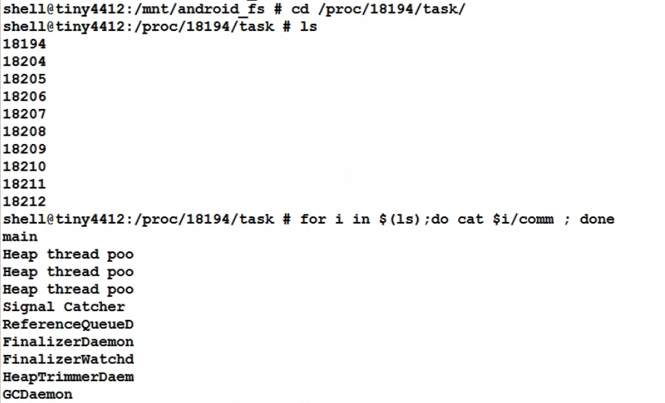

# 在Android上编译启动java程序

## dalvikvm 达尔维克
java程序是在虚拟机环境中运行的，与Windows环境不通，在Android里是在_dalvikvm_的虚拟机里运行。
***************

CLASSPATH=...  app_process [java-options] cmd-dir start-class-name [options]


##### Java源码: 01th_hello
```
javac Hello.java
dx --dex --output=Hello.jar Hello.class
```
* PC:
```
java Hello
```
* Android:
```
dalvikvm -cp /mnt/Android_fs/Hello.jar Hello
CLASSPATH=/mnt/android_fs/Hello.jar app_process /mnt/android_fs Hello
```
##### Java源码: 11th_package/01
```
javac -d . Pack.java
dx --dex --output=pack.jar ./
```
* PC:      
```
java a.b.c.d.Pack
```
* Android:
```
dalvikvm -cp /mnt/android_fs/pack.jar a.b.c.d.Pack 
CLASSPATH=/mnt/android_fs/pack.jar app_process /mnt/android_fs a.b.c.d.Pack
```
##### Java源码: 11th_package/02
```
javac -d . lisi/Math.java
javac -d . zhangsan/Math.java
javac -d . zhangsan/Print.java
dx --dex --output=pack.jar ./
javac Pack.java
```
* PC:
```
java Pack
```
* Android:
```
dalvikvm -cp /mnt/android_fs/pack.jar Pack 
CLASSPATH=/mnt/android_fs/pack.jar app_process /mnt/android_fs Pack
```
## 把代码放到android源码中编译:
* 添加Androd.mk，内容类似:  // 参考frameworks/base/cmds/am/Android.mk
```
LOCAL_PATH:= $(call my-dir)

include $(CLEAR_VARS)
LOCAL_SRC_FILES := $(call all-subdir-java-files)
LOCAL_MODULE := pack
include $(BUILD_JAVA_LIBRARY)
```
### 启动方式的差别:
运行Hello.java
```
public class Hello {
  public static void main(String args[]) {
    for(int i = 0; i < 3; i++)
      System.out.println("hello world");
    while(true) {

        try {
            Thread.sleep(100);
        } catch (Exception e) {

        }
    }
  }
}
```
1. dalvikvm



2. app_process ：会创建2个binder线程: Binder_1, Binder_2


app_process对应的源码是frameworks/base/cmds/app_main.cpp

